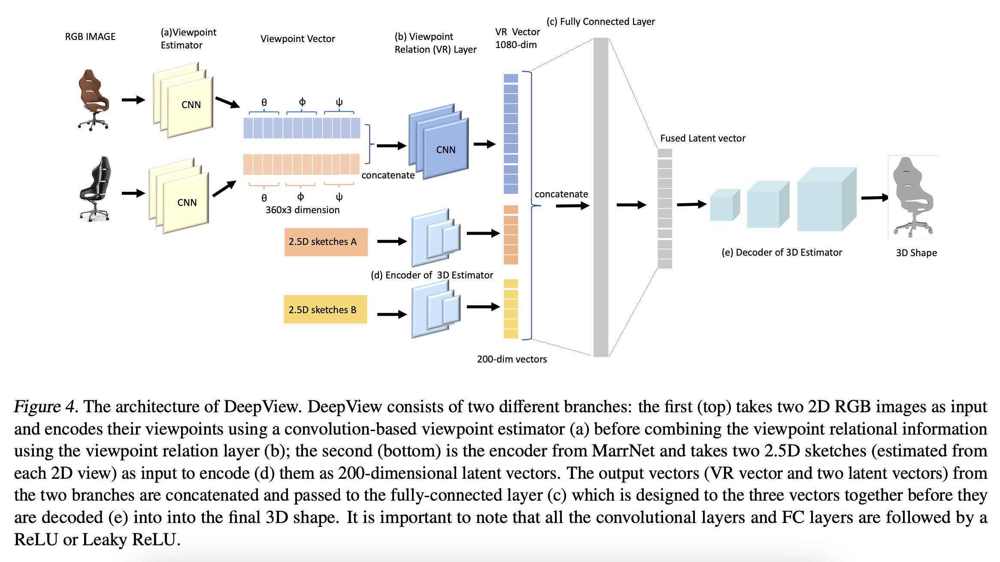
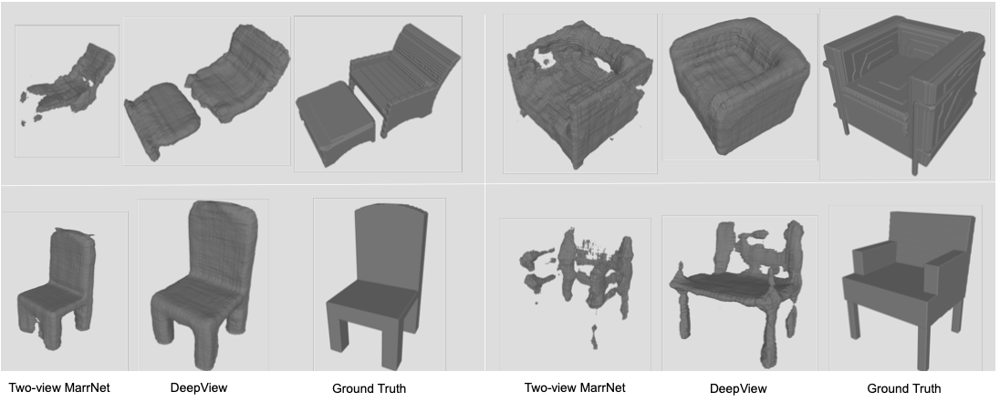
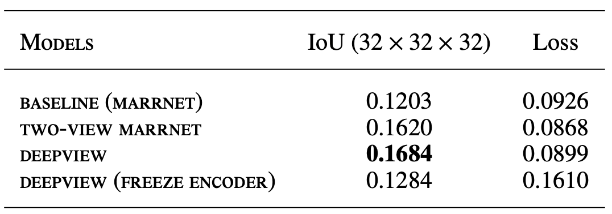

# 3D Reconstruction from Two-View images by exploiting viewpoint relation

We proposed a state-of-the-art 3D shape reconstruction algorithm, DeepView which explicitly esimates the viewpoint of each input/view of an object and infers the viewpoint relation.

This work won **1st Place of IBM Machine Learning Prize** competition, which was assessed by a panel of industry expert from IBM and Senior acamdemics from University of Edinburgh.

## Introduction
The state-of-the-art methods that reconstruct 3D shape from a single view, is limited because there are parts of the object that are hidden from a 2D view input. To improve this, we first proposed the [Two-View MarrNet](https://github.com/Xingyu-Jin/Two-view-3D-construction.git) architecture which takes in an additional view as input and combines two input views using various fusion techniques. The best model which concatenates the latent vectors of the two views improves the reconstruction accuracy over the baseline by **4.2% (IoU)** – on a dataset derived from ShapeNet. Futhermore, we proposed our novel DeepView architecture which explicitly estimates the viewpoint of each input and infers the viewpoint relation. 

Overall, the [DeepView](https://github.com/Xingyu-Jin/DeepView3D.git) architecture improves the accuracy of 3D reconstruction by **4.8% (IoU)** over the baseline. It also converges **35% faster** than the baseline.




## Papers

This is a repo covering the following two papers. 

1. DeepView3D<br/>
**3D Shape Reconstruction from Two View Images via explicit viewpoint estimation and viewpoint relation inference**<br/>
[Xingyu Jin](https://www.linkedin.com/in/eddie-xingyu-jin/), Siqing Geng, and Mek Bhumiwat<br/>
*First Place -- IBM Machine Learning Prize 2019, IBM and University of Edinburgh*<br/>
[Report](https://drive.google.com/file/d/1bFkCvV8H3wrsdBJbaRIOuEFsZkIrs3mL/view?usp=share_link) &nbsp; | &nbsp; [Slides](https://drive.google.com/file/d/1mlLPBmGnhuWhpHFWcZA4UvCuQSmyIUJl/view?usp=share_link) &nbsp; | &nbsp; [Project](https://github.com/Xingyu-Jin/DeepView3D.git)<br/>

1. Two-View Marrnet<br/>
**Fusing Two Views for 3D Completion and Reconstruction**<br/>
[Xingyu Jin](https://www.linkedin.com/in/eddie-xingyu-jin/), Siqing Geng, and Mek Bhumiwat<br/>
*First Place -- IBM Machine Learning Prize 2019, IBM and University of Edinburgh*<br/>
[Report](https://drive.google.com/file/d/1bFkCvV8H3wrsdBJbaRIOuEFsZkIrs3mL/view?usp=share_link) &nbsp; | &nbsp; [Slides](https://drive.google.com/file/d/1mlLPBmGnhuWhpHFWcZA4UvCuQSmyIUJl/view?usp=share_link) &nbsp; | &nbsp; [Project](https://github.com/Xingyu-Jin/Two-view-3D-construction.git)<br/>

1. MarrNet<br/>
**MarrNet: 3D Shape Reconstruction via 2.5D Sketches**<br/>
[Jiajun Wu](https://jiajunwu.com/)&ast;, [Yifan Wang](https://homes.cs.washington.edu/~yifan1/)&ast;, [Tianfan Xue](https://people.csail.mit.edu/tfxue/), [Xingyuan Sun](http://people.csail.mit.edu/xingyuan/), [William T. Freeman](https://billf.mit.edu/), and [Joshua B. Tenenbaum](http://web.mit.edu/cocosci/josh.html)<br/>
*NeurIPS 2017*<br/>
[Paper](http://marrnet.csail.mit.edu/papers/marrnet_nips.pdf) &nbsp; | &nbsp; Slides &nbsp; | &nbsp; [Project](http://marrnet.csail.mit.edu/)


## Environment Setup

All code was built and tested on Ubuntu 16.04.5 LTS with Python 3.6, PyTorch 0.4.1, and CUDA 9.0. Versions for other packages can be found in `environment.yml`.

1. Clone this repo with
	```
    # cd to the directory you want to work in
	git clone https://github.com/Xingyu-Jin/DeepView3D.git
	cd DeepView3D
	```
	The code below assumes you are at the repo root.

1. Create a conda environment named `shaperecon` with necessary dependencies specified in `environment.yml`. In order to make sure trimesh is installed correctly, please run `install_trimesh.sh` after setting up the conda environment.
	```
	conda env create -f environment.yml
	./install_trimesh.sh
	```
	The TensorFlow dependency in `environment.yml` is for using TensorBoard only. Remove it if you do not want to monitor your training with TensorBoard.

1. The instructions below assume you have activated this environment with
	```
	source activate shaperecon
	```


## Downloading Our Trained Models and Training Data

### Models

To download our trained GenRe and ShapeHD models (1 GB in total), run
```
wget http://genre.csail.mit.edu/downloads/genre_shapehd_models.tar -P downloads/models/
tar -xvf downloads/models/genre_shapehd_models.tar -C downloads/models/
```

* GenRe: `depth_pred_with_inpaint.pt` and `full_model.pt`
* ShapeHD: `marrnet1_with_minmax.pt` and `shapehd.pt`

### Data

This repo comes with a few [Pix3D](http://pix3d.csail.mit.edu/) images and [ShapeNet](https://www.shapenet.org/) renderings, located in `downloads/data/test`, for testing purposes.

For training, we make available our RGB and 2.5D sketch renderings, paired with their corresponding 3D shapes, for ShapeNet cars, chairs, and airplanes, with each object captured in 20 random views. Note that this `.tar` is 143 GB.
```
wget http://genre.csail.mit.edu/downloads/shapenet_cars_chairs_planes_20views.tar -P downloads/data/
mkdir downloads/data/shapenet/
tar -xvf downloads/data/shapenet_cars_chairs_planes_20views.tar -C downloads/data/shapenet/
```


## Testing with Our Models

We provide `.sh` wrappers to perform testing for GenRe, ShapeHD, and MarrNet (without the reprojection consistency part).

### GenRe

See `scripts/test_genre.sh`.

<p align="center">
	
</p>

We updated our entire pipeline to support fully differentiable end-to-end finetuning. In our NeurIPS submission, the projection from depth images to spherical maps was not implemented in a differentiable way. As a result of both the pipeline and PyTorch version upgrades, the model performace is slightly different from what was reported in the original paper.

Below we tabulate the original vs. updated Chamfer distances (CD) across different Pix3D classes. The "Original" row is from Table 2 of the paper.

|          |Chair | Bed | Bookcase  | Desk  | Sofa |  Table  | Wardrobe |
|----------|:----:|:---:|:---:|:---:|:---:|:---:|:---:|
|  **Updated** | .094 | .117  | .104  | .110  |  .086  | .114 | .106 |
| **Original** | .093 | .113  | .101  | .109  |  .083  | .116 | .109 |

### ShapeHD

See `scripts/test_shapehd.sh`.

<p align="center">
	
</p>

After ECCV, we upgraded our entire pipeline and re-trained ShapeHD with this new pipeline. The models released here are newly trained, producing quantative results slightly better than what was reported in the ECCV paper. If you use [the Pix3D repo](https://github.com/xingyuansun/pix3d) to evaluate the model released here, you will get an average CD of 0.122 for the 1,552 untruncated, unoccluded chair images (whose inplane rotation < 5&deg;). The average CD on Pix3D chairs reported in the paper was 0.123.

### MarrNet w/o Reprojection Consistency

See `scripts/test_marrnet.sh`.

The architectures in this implementation of MarrNet are different from those presented in the original NeurIPS 2017 paper. For instance, the reprojection consistency is not implemented here. MarrNet-1 that predicts 2.5D sketches from RGB inputs is now a U-ResNet, different from its original architecture. That said, the idea remains the same: predicting 2.5D sketches as an intermediate step to the final 3D voxel predictions.

If you want to test with the original MarrNet, see [the MarrNet repo](https://github.com/jiajunwu/marrnet) for the pretrained models.


## Training Your Own Models

This repo allows you to train your own models from scratch, possibly with data different from our training data provided above. You can monitor your training with TensorBoard. For that, make sure to include `--tensorboard` while running `train.py`, and then run
```
python -m tensorboard.main --logdir="$logdir"/tensorboard
```
to visualize your losses.

### GenRe

Follow these steps to train the GenRe model.
1. Train the depth estimator with `scripts/train_marrnet1.sh`
1. Train the spherical inpainting network with `scripts/train_inpaint.sh`
1. Train the full model with `scripts/train_full_genre.sh`

### ShapeHD

Follow these steps to train the ShapeHD model.
1. Train the 2.5D sketch estimator with `scripts/train_marrnet1.sh`
1. Train the 2.5D-to-3D network with `scripts/train_marrnet2.sh`
1. Train a 3D-GAN with `scripts/train_wgangp.sh`
1. Finetune the 2.5D-to-3D network with perceptual losses provided by the discriminator of the 3D-GAN, using `scripts/finetune_shapehd.sh`

### MarrNet w/o Reprojection Consistency

Follow these steps to train the MarrNet model, excluding the reprojection consistency.
1. Train the 2.5D sketch estimator with `scripts/train_marrnet1.sh`
1. Train the 2.5D-to-3D network with `scripts/train_marrnet2.sh`
1. Finetune the 2.5D-to-3D network with `scripts/finetune_marrnet.sh`

## Result

Here are some most challenging examples of reconstructed 3D shapes from DeepView compared with Two-View MarrNet (Multi-layer B) and ground truth. The reconstructed 3D shapes from DeepView tend to be more complete with higher details than those from Two-View MarrNet.



The following table shows 3D reconstruction performances (IoU and loss) of DeepView compared with the best Two-View MarrNet (vector concatenation) and baseline (MarrNet) on test set. Best IoU performance is shown in bold.




## Questions

Please open an issue if you encounter any problem.


## Changelog

* Dec. 28, 2019: Initial Release
